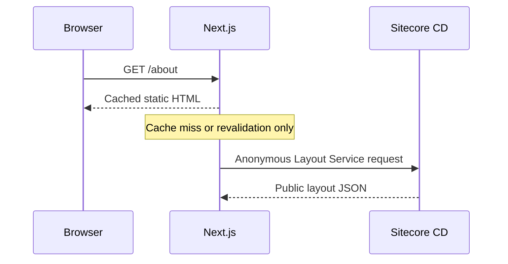
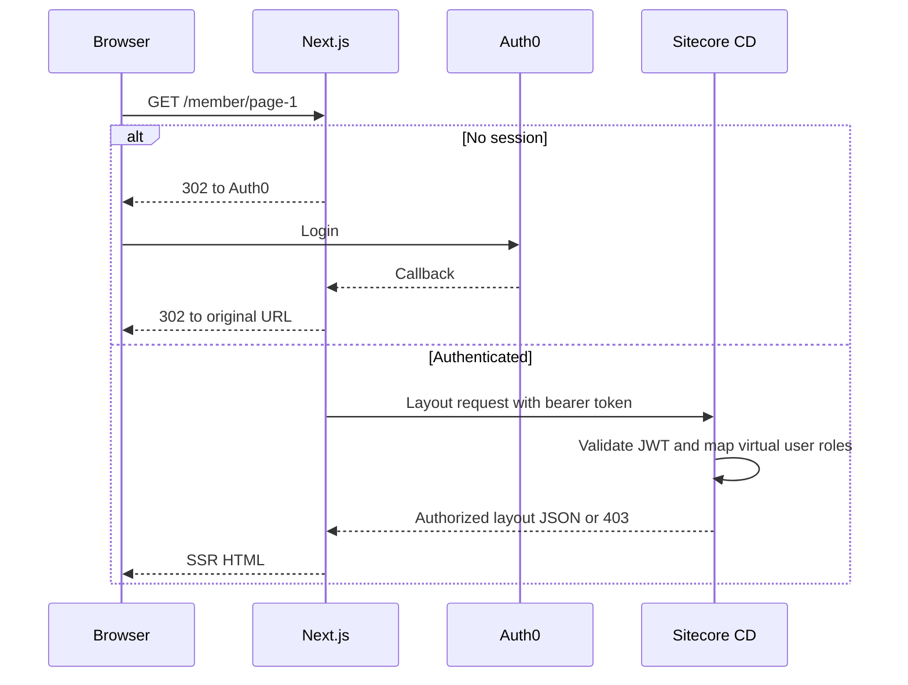
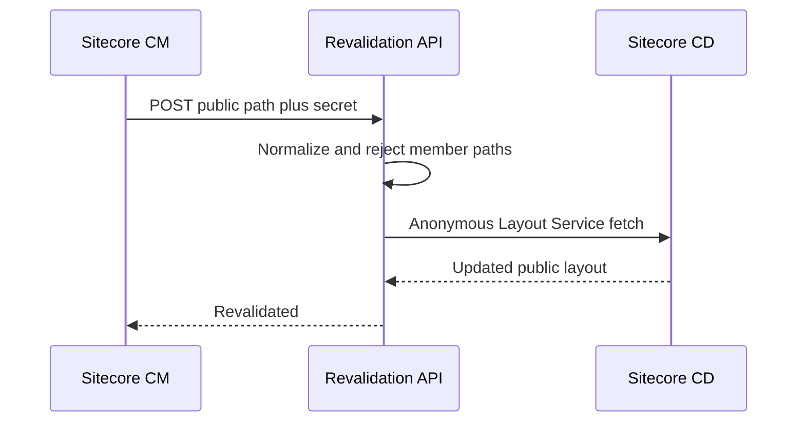

# Architecture

## Executive decision

Use a hybrid Pages Router design with two physical Next.js routes, both nested under the existing `[locale]` segment used for domain-based i18n:

| Route | Rendering | Sitecore identity | Cache behavior |
| --- | --- | --- | --- |
| `src/pages/[locale]/[[...path]].tsx` | SSG | `extranet\\anonymous` | Generated once and updated by on-demand ISR |
| `src/pages/[locale]/member/[[...path]].tsx` | SSR | Request-scoped virtual user | Never placed in the ISR cache |

Next.js gives the explicit `member` route precedence over the optional catch-all route within the same `[locale]` segment. Sitecore itself documents this pattern for JSS hybrid rendering.

`locale` is never present in the public-facing URL. It is populated by the invisible subdomain-based middleware rewrite described in [domain-based-i18n-ssg-isr.md](../language-subdomain-poc/domain-based-i18n-ssg-isr.md) (`src/lib/middleware/plugins/locale-rewrite.ts`), which already applies to every non-API, non-`_next` path, including `/member` and its descendants. The member route must read locale from `context.params.locale`, exactly like `normal-mode.ts` does for the public route - never re-derive it from `req.headers.host` inside the page.

## Components

| Component | Responsibility |
| --- | --- |
| Browser | Holds only the encrypted Auth0 session cookie and renders HTML |
| Next.js JSS server | Starts login, reads the server-side session, performs SSR, forwards the access token only on server-to-server requests |
| Auth0 | Authenticates test users and issues an API access token containing a namespaced role claim |
| Sitecore CD .NET extension | Validates the token and maps trusted external roles to Sitecore roles |
| Sitecore Layout Service | Resolves the route and applies normal Sitecore item security under the virtual user |
| Sitecore CM publishing event or manual tool | Calls the protected Next.js revalidation endpoint for public paths |

## Public request flow

## Member request flow

## Publish and revalidation flow

## Trust boundaries

1. The browser is untrusted. A browser-provided role, email, or route flag is never authorization evidence.
2. Next.js validates its Auth0 session and obtains the access token server-side.
3. Sitecore independently validates the access token. Trusting Next.js without token validation would make Layout Service bypassable.
4. Auth0 role names are not Sitecore role names. A fixed code/config map translates only expected values.
5. Sitecore item ACLs make the final content authorization decision.

## Recommended role model

| Auth0 role | Sitecore role | Intended access |
| --- | --- | --- |
| `member-basic` | `extranet\\Extranet 1` | Member root and basic pages, via the shared base role |
| `member-premium` | `extranet\\Extranet 2` | Premium page, via the shared base role plus an explicit premium grant |

There is no direct inheritance between `extranet\\Extranet 1` and `extranet\\Extranet 2`. Both are members of a common base role, `extranet\\Base Extranet`, which is the only role granted read access on the member root and descendants. Deny read access to `extranet\\anonymous` on the member root. Add an explicit read grant on the premium-only item for `extranet\\Extranet 2` only; leave `extranet\\Extranet 1` without that grant (or an explicit deny) so basic members cannot read it.

## Why the .NET backend lives inside Sitecore CD

Virtual users and Sitecore roles belong to the Sitecore Security API. Putting token validation and virtual-user creation in a small CD extension demonstrates the requirement directly and avoids a second service that would still need a trusted integration into Sitecore. Auth0 remains the identity provider. The extension is the resource-server authentication adapter.

If a later production architecture requires a standalone ASP.NET Core gateway, keep the same token and role contract, but treat that as a separate design milestone after the POC.

## Response behavior

| Condition | Next.js result | Sitecore result |
| --- | --- | --- |
| Public route | Static HTML | Anonymous layout allowed |
| Member route, no session | Redirect to login | No Sitecore call |
| Valid token and allowed role | SSR HTML | `200` layout JSON |
| Valid token, no mapped role | `403` page | `403` |
| Invalid or expired token | Clear/restart session or `401` | `401` |
| Missing Sitecore item | `404` page | `404` or empty route |

## Deployment note

On-demand ISR requires a persistent Node.js server runtime. It does not work with `next export`. If multiple Next.js instances are used later, the ISR cache must be shared or invalidation must reach every instance. A single instance is acceptable for the POC.

